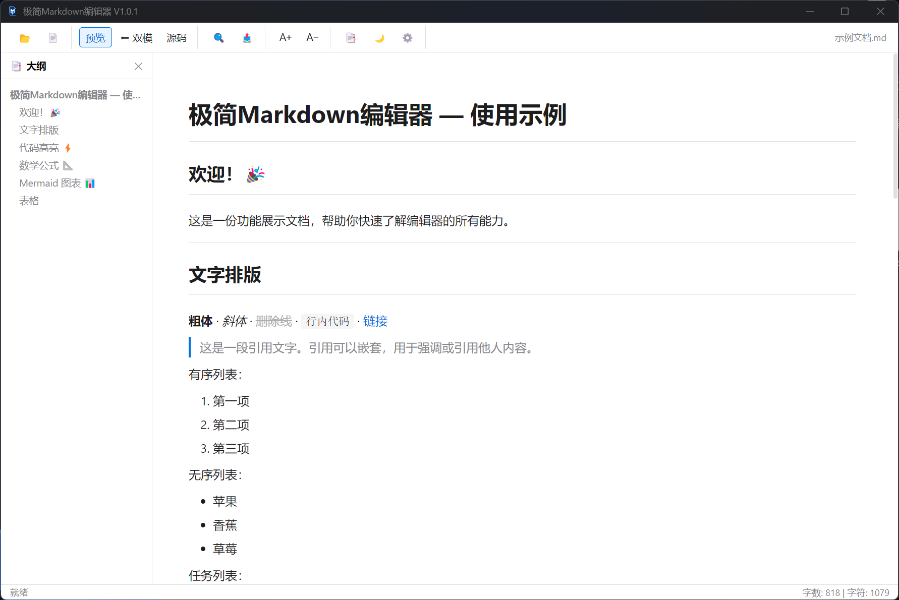
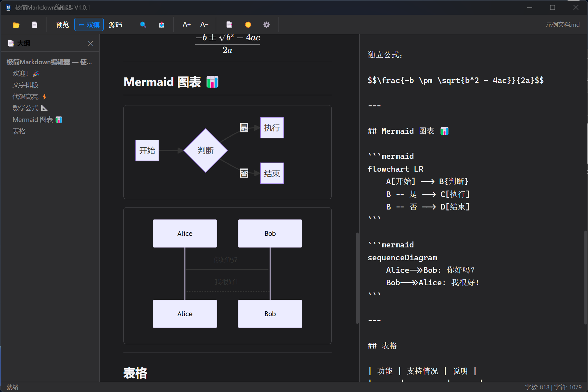

# 极简 Markdown 编辑器 / Minimal Markdown Editor

<p align="center">
  
</p>

<p align="center">
  <strong>轻量、快速、安全的桌面 Markdown 编辑器</strong>
  <br>
  <strong>A lightweight, fast, and secure desktop Markdown editor</strong>
  <br><br>
  基于 Electron · 开源免费 · 支持 Mermaid、KaTeX 与代码高亮
  <br>
  Built with Electron · Free and open source · Mermaid, KaTeX, and syntax highlighting
</p>

<p align="center">
  <a href="https://github.com/yibanyiban78/markdown-editor/releases/latest">
    
  </a>
  <a href="https://github.com/yibanyiban78/markdown-editor/releases">
    
  </a>
  <a href="https://github.com/yibanyiban78/markdown-editor/blob/main/LICENSE">
    
  </a>
</p>

<p align="center">
  <a href="#中文">中文</a> ·
  <a href="#english">English</a>
</p>

---

<a id="中文"></a>

## 中文

### 预览

| 浅色预览模式 | 深色双栏编辑模式 |
|:------------:|:----------------:|
|  |  |

按下 <kbd>Ctrl</kbd> + <kbd>O</kbd> 打开 Markdown 文件，即可开始编辑。

### 功能特性

#### 编辑体验

- **三种编辑模式**：预览、双栏和源码模式
- **实时 Markdown 渲染**：基于 marked，支持 GFM 常用语法
- **语法高亮**：基于 highlight.js，支持多种编程语言
- **数学公式**：通过 KaTeX 支持行内公式 `$...$` 和块级公式 `$$...$$`
- **图表渲染**：通过 Mermaid 支持流程图、时序图和甘特图等
- **同步滚动**：双栏模式下源码与预览同步浏览

#### 文件与数据

- **打开、新建和保存**：支持 `.md`、`.markdown` 和 `.txt` 文件
- **拖放打开**：将文件拖入窗口即可开始编辑
- **自动保存**：已授权文件在修改 1.5 秒后自动写回，可在设置中关闭
- **未保存保护**：新建、打开其他文件或关闭窗口前提示保存未提交内容
- **本地处理**：文档内容保留在本机，不上传到项目服务器

#### 安全与离线使用

- **HTML 净化**：使用 DOMPurify 处理 Markdown 生成的 HTML
- **受限文件访问**：渲染进程不能读取任意本地路径
- **安全的 Electron 配置**：启用上下文隔离与沙箱，禁用 Node.js 集成
- **外部导航限制**：网页链接交由系统默认浏览器打开
- **依赖本地化**：渲染库随应用打包，常规编辑和预览无需 CDN

> 文档中的远程图片仍可能向图片服务器发送网络请求。

#### 导出与界面

- **导出 HTML**：生成可独立打开的完整 HTML 文档
- **导出 PDF**：生成仅包含文档内容的 PDF 文件
- **深色与浅色主题**：自动保存主题偏好
- **大纲面板**：提取 H1-H3 标题并支持点击跳转
- **字体调节**：编辑器字号支持 11px-24px
- **搜索与统计**：提供全文搜索、匹配跳转和实时字数统计

### 下载与安装

请从 [Releases 页面](https://github.com/yibanyiban78/markdown-editor/releases) 下载最新版本：

| 类型 | 说明 |
|------|------|
| `*-setup.exe` | **安装版，推荐**：提供安装向导并创建桌面快捷方式 |
| `*-portable.exe` | **便携版**：无需安装，可直接运行 |

当前稳定版本为 [`v1.0.2`](https://github.com/yibanyiban78/markdown-editor/releases/tag/v1.0.2)。

### 从源码运行

#### 环境要求

- [Node.js](https://nodejs.org/) 22 或更高版本
- npm
- Windows 10/11（构建 Windows 安装包时）

#### 安装与启动

```bash
git clone https://github.com/yibanyiban78/markdown-editor.git
cd markdown-editor
npm install
npm start
```

`npm install` 会运行 `scripts/sync-vendor.js`，将前端运行依赖复制到 `src/vendor/`。

#### 测试与构建

```bash
# 运行自动化测试
npm test

# 生成未安装的应用目录
npm run pack

# 生成 Windows 安装版和便携版
npm run dist
```

构建产物位于 `release/` 目录。发布提交或 `v*` 标签会触发 GitHub Actions 构建流程。

### 快捷键

| 快捷键 | 功能 |
|--------|------|
| <kbd>Ctrl</kbd> + <kbd>N</kbd> | 新建文件 |
| <kbd>Ctrl</kbd> + <kbd>O</kbd> | 打开文件 |
| <kbd>Ctrl</kbd> + <kbd>S</kbd> | 保存文件 |
| <kbd>Ctrl</kbd> + <kbd>F</kbd> | 搜索 |
| <kbd>Ctrl</kbd> + <kbd>Shift</kbd> + <kbd>O</kbd> | 切换大纲面板 |
| <kbd>Esc</kbd> | 关闭搜索栏 |

### 项目结构

```text
markdown-editor/
├── .github/workflows/   # GitHub Actions 构建与发布
├── assets/              # 应用图标和截图
├── scripts/
│   └── sync-vendor.js   # 将前端依赖同步到 src/vendor
├── src/
│   ├── index.html       # 应用入口页面
│   ├── js/              # 编辑器、预览、导出、搜索和设置
│   ├── styles/          # 界面与 Markdown 样式
│   └── vendor/          # 安装依赖时生成的本地前端库
├── test/                # Node.js 自动化测试
├── main.js              # Electron 主进程与安全 IPC
├── preload.js           # 受限的上下文桥接 API
└── package.json         # 项目、依赖和构建配置
```

### 技术栈

| 技术 | 用途 |
|------|------|
| Electron 42 | 桌面应用框架 |
| marked | Markdown 解析 |
| DOMPurify | HTML 安全净化 |
| highlight.js | 代码语法高亮 |
| KaTeX | 数学公式渲染 |
| Mermaid | 图表渲染 |
| electron-builder | Windows 打包与分发 |
| Node.js Test Runner + jsdom | 自动化与安全回归测试 |

### 参与项目

- 为仓库点亮 Star
- Fork 项目并提交 Pull Request
- 在 [Issues](https://github.com/yibanyiban78/markdown-editor/issues) 中报告问题或提出建议

### 许可证与隐私

- [MIT License](LICENSE) © yibanyiban78
- [隐私政策](PRIVACY.md)

---

<a id="english"></a>

## English

### Preview

| Light preview mode | Dark split-view mode |
|:------------------:|:--------------------:|
|  |  |

Press <kbd>Ctrl</kbd> + <kbd>O</kbd> to open a Markdown file and start editing.

### Features

#### Editing

- **Three editing modes**: preview, split view, and source mode
- **Live Markdown rendering**: powered by marked with common GFM syntax
- **Syntax highlighting**: powered by highlight.js with support for many languages
- **Math expressions**: KaTeX support for inline `$...$` and display `$$...$$` formulas
- **Diagrams**: Mermaid support for flowcharts, sequence diagrams, Gantt charts, and more
- **Synchronized scrolling**: source and preview panes stay aligned in split view

#### Files and data

- **Open, create, and save**: supports `.md`, `.markdown`, and `.txt` files
- **Drag and drop**: drop a file into the window to start editing
- **Auto-save**: authorized files are saved 1.5 seconds after editing; this can be disabled
- **Unsaved-change protection**: prompts before creating, opening, or closing over pending work
- **Local processing**: document contents remain on your computer and are not uploaded to a project server

#### Security and offline operation

- **HTML sanitization**: DOMPurify cleans HTML generated from Markdown
- **Restricted file access**: the renderer cannot read arbitrary local paths
- **Secure Electron settings**: context isolation and sandboxing are enabled; Node.js integration is disabled
- **Restricted navigation**: external links are handed to the system browser
- **Bundled dependencies**: rendering libraries ship with the app, so normal editing and previewing do not require a CDN

> Remote images embedded in a document may still send requests to their image servers.

#### Export and interface

- **HTML export**: creates a complete standalone HTML document
- **PDF export**: creates a PDF containing only the rendered document
- **Light and dark themes**: remembers your theme preference
- **Outline panel**: extracts H1-H3 headings and supports click-to-navigate
- **Font controls**: editor font sizes from 11px to 24px
- **Search and statistics**: full-text search, match navigation, and live character counts

### Download and install

Download the latest build from the [Releases page](https://github.com/yibanyiban78/markdown-editor/releases):

| Type | Description |
|------|-------------|
| `*-setup.exe` | **Installer, recommended**: includes a setup wizard and desktop shortcut |
| `*-portable.exe` | **Portable build**: runs directly without installation |

The current stable version is [`v1.0.2`](https://github.com/yibanyiban78/markdown-editor/releases/tag/v1.0.2).

### Run from source

#### Requirements

- [Node.js](https://nodejs.org/) 22 or later
- npm
- Windows 10/11 when building the Windows distributions

#### Install and start

```bash
git clone https://github.com/yibanyiban78/markdown-editor.git
cd markdown-editor
npm install
npm start
```

`npm install` runs `scripts/sync-vendor.js`, which copies the frontend runtime dependencies into `src/vendor/`.

#### Test and build

```bash
# Run the automated test suite
npm test

# Create an unpacked application directory
npm run pack

# Build the Windows installer and portable edition
npm run dist
```

Build output is written to `release/`. Release commits and `v*` tags trigger the GitHub Actions build workflow.

### Keyboard shortcuts

| Shortcut | Action |
|----------|--------|
| <kbd>Ctrl</kbd> + <kbd>N</kbd> | New file |
| <kbd>Ctrl</kbd> + <kbd>O</kbd> | Open file |
| <kbd>Ctrl</kbd> + <kbd>S</kbd> | Save file |
| <kbd>Ctrl</kbd> + <kbd>F</kbd> | Search |
| <kbd>Ctrl</kbd> + <kbd>Shift</kbd> + <kbd>O</kbd> | Toggle the outline panel |
| <kbd>Esc</kbd> | Close the search bar |

### Project structure

```text
markdown-editor/
├── .github/workflows/   # GitHub Actions build and release workflow
├── assets/              # Application icons and screenshots
├── scripts/
│   └── sync-vendor.js   # Copies frontend dependencies into src/vendor
├── src/
│   ├── index.html       # Application entry page
│   ├── js/              # Editor, preview, export, search, and settings
│   ├── styles/          # Interface and rendered Markdown styles
│   └── vendor/          # Local frontend libraries generated on install
├── test/                # Node.js automated tests
├── main.js              # Electron main process and secure IPC
├── preload.js           # Restricted context bridge API
└── package.json         # Project, dependency, and build configuration
```

### Technology

| Technology | Purpose |
|------------|---------|
| Electron 42 | Desktop application framework |
| marked | Markdown parsing |
| DOMPurify | HTML sanitization |
| highlight.js | Syntax highlighting |
| KaTeX | Math rendering |
| Mermaid | Diagram rendering |
| electron-builder | Windows packaging and distribution |
| Node.js Test Runner + jsdom | Automated and security regression testing |

### Contributing

- Star the repository
- Fork the project and open a Pull Request
- Report bugs or suggest improvements through [Issues](https://github.com/yibanyiban78/markdown-editor/issues)

### License and privacy

- [MIT License](LICENSE) © yibanyiban78
- [Privacy Policy](PRIVACY.md)
