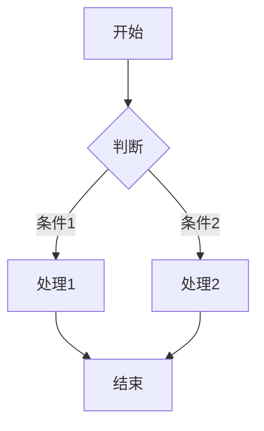

# 欢迎使用 Markdown 编辑器 🎉

这是一段**加粗文字**和*斜体文字*，还有 ~~删除线~~。

## 基础语法

### 列表
- 项目一
- 项目二
  - 子项目 A
  - 子项目 B
- 项目三

1. 第一步
2. 第二步
3. 第三步

### 引用
> 这是一段引用文字
> 可以跨多行

### 代码
行内代码 `console.lo      ('hello')`

```javascript
// 代码块支持语法高亮
function eet(name) {
  return `Hello, ${name}!`;
}
console.lo (reet('Markdown'));
```

### 表格
| 功能 | 状态 | 说明 |
|------|------|------|
| 加粗 | ✅ | 已支持 |
| 代码高亮 | ✅ | highlight.js |
| 数学公式 | ✅ | KaTeX |
| 图表 | ✅ | Mermaid |

### 任务列表
- [x] 已完成任务
- [ ] 未完成任务
- [ ] 待办事项

## 扩展功能

### 数学公式
行内公式：$E = mc^2$

独立公式：
$$\sum_{i=1}^{n} i = \frac{n(n+1)}{2}$$

### Mermaid 流程图


### 图片


## 快捷键

| 快捷键 | 功能 |
|--------|------|
| Ctrl+N | 新建文件 |
| Ctrl+O | 打开文件 |
| Ctrl+S | 保存文件 |
| Ctrl+F | 搜索 |
| Ctrl+Shift+F | 打开文件夹 |
| Escape | 关闭搜索 |
