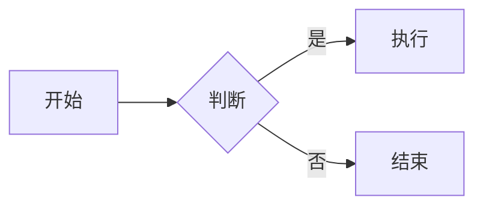
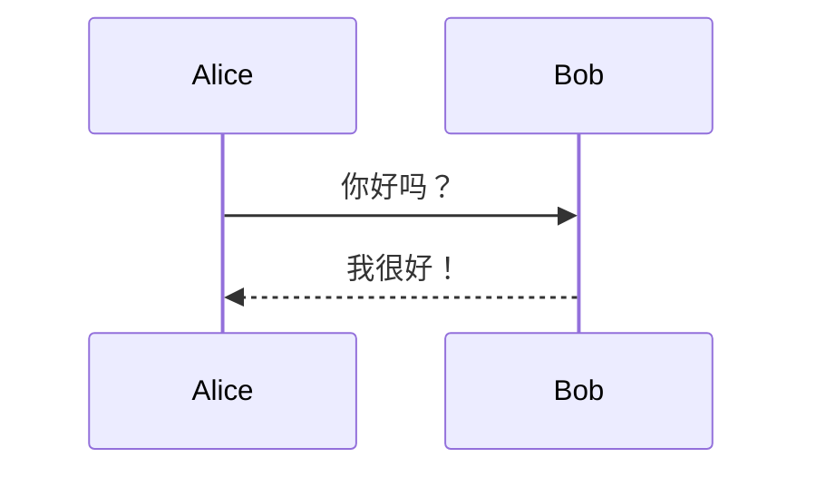

# 极简Markdown编辑器 — 使用示例

## 欢迎！🎉

这是一份功能展示文档，帮助你快速了解编辑器的所有能力。

---

## 文字排版

**粗体** · *斜体* · ~~删除线~~ · `行内代码` · [链接](https://github.com/yibanyiban78/markdown-editor)

> 这是一段引用文字。引用可以嵌套，用于强调或引用他人内容。

有序列表：
1. 第一项
2. 第二项
3. 第三项

无序列表：
- 苹果
- 香蕉
- 草莓

任务列表：
- [x] 已完成任务
- [ ] 未完成任务

---

## 代码高亮 ⚡

```javascript
function hello() {
  console.log("Hello, Markdown!");
}
```

```python
def fibonacci(n):
    a, b = 0, 1
    for _ in range(n):
        print(a, end=' ')
        a, b = b, a + b
```

---

## 数学公式 📐

行内公式：$E = mc^2$

独立公式：

$$\frac{-b \pm \sqrt{b^2 - 4ac}}{2a}$$

---

## Mermaid 图表 📊





---

## 表格

| 功能 | 支持情况 | 说明 |
|------|---------|------|
| 语法高亮 | ✅ | 190+ 语言 |
| 数学公式 | ✅ | KaTeX 引擎 |
| 图表 | ✅ | Mermaid |
| 导出 HTML | ✅ | 浏览器/打印 |
| 导出 PDF | ✅ | 浏览器打印 |

---

> ✨ **提示**：按 `Ctrl+O` 打开自己的 .md 文件，按 `Ctrl+S` 保存。
>
> 本项目开源免费，欢迎 Star ⭐ → [GitHub 仓库](https://github.com/yibanyiban78/markdown-editor)
